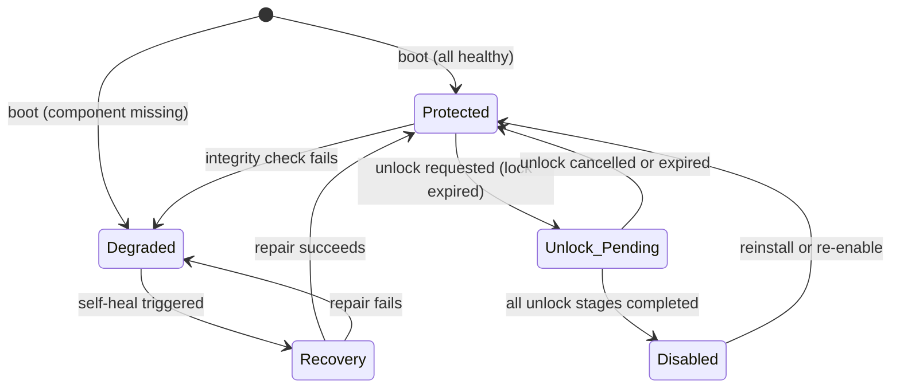

# Aegis Architecture

## 1. Architectural style

Use clean architecture with explicit boundaries:
- UI layer
- Application layer
- Domain layer
- Infrastructure layer

Each module should be independently testable and communicate through interfaces.

## 2. Module registry (single source of truth)

Every document that references Aegis modules must use this table as the canonical list.

| # | Module | Classification | Status | Description |
|---|---|---|---|---|
| 1 | Windows Service | CORE | Implemented (M1) | Host process, state owner, API host, module coordinator |
| 2 | Watchdog | CORE | Skeleton (M0) | Monitors the service, restarts on failure, emits health events |
| 3 | Browser Extension | CORE | Skeleton (M0) | MV3 Chromium extension for URL/keyword/DOM inspection |
| 4 | DNS Filter | CORE | Implemented (M2) | Local DNS proxy, domain blocklist enforcement |
| 5 | Rule Engine | CORE | Pending (M3) | Evaluates rules in priority order, produces allow/block decisions |
| 6 | Keyword Engine | CORE | Pending (M3) | Keyword matching, search-query evaluation, dynamic blacklists |
| 7 | Regex Engine | CORE | Pending (M3) | Domain-token matching, URL-pattern scoring, heuristics |
| 8 | Integrity Engine | CORE | Pending (M6) | Boot-time and periodic audits, self-healing, degraded-mode transitions |
| 9 | Commit-Lock Engine | CORE | Pending (M5) | 25-day timer, unlock workflow, uninstall gating |
| 10 | Storage | CORE | Implemented (M1) | SQLite access, schema versioning, backup/restore |
| 11 | Security | CORE | Helpers (M1) | Auth, token issuance, HMAC verification, file integrity |
| 12 | Local API | CORE | Subsystem (M1) | Authenticated localhost HTTP + named pipe endpoints |
| 13 | Logging | CORE | Implemented (M0) | Structured JSON logs, rotation, diagnostics |
| 14 | Installer | CORE | Dev Script (M1) | Deploys service, extension, config, database, keys |
| 15 | Uninstaller | CORE | Pending (M9) | Verifies unlock, staged confirmations, clean removal |
| 16 | UI | CORE | Dashboard Shell (M1) | WinUI 3 dashboard, status cards, settings, unlock screens |
| 17 | Proxy | EXTENDED | Deferred (M7) | Optional HTTP(S) inspection layer (deferred to Milestone 7) |
| 18 | AI Modules | EXTENDED | Deferred (M8) | Optional text/image classification (deferred to Milestone 8) |

## 3. Core data flow

1. Browser or OS emits a request.
2. The extension, proxy, or DNS layer intercepts it.
3. The rule engine evaluates domain, keyword, and policy rules.
4. The rule engine returns allow/block/redirect/degraded.
5. The service records the event and updates state.
6. The UI reflects the current protection status.

## 4. Runtime topology

### 4.1 Windows Service
- Starts on boot.
- Owns global enforcement state.
- Manages health checks and policy distribution.
- Exposes a secure local API.

### 4.2 Watchdog
- Monitors the service.
- Restarts it when possible.
- Emits health events.

### 4.3 Browser Extension
- Inspects browser-visible URLs, titles, search terms, and DOM signals.
- Sends handshake heartbeats.
- Receives policy updates.

### 4.4 DNS Module
- Provides local DNS interception or forwarding.
- Applies domain blocklists.
- Detects suspicious domains.

### 4.5 Proxy Module
- Optional system-wide or browser-wide HTTP(S) inspection layer.
- Allows keyword and content-based blocking outside DNS capability.

### 4.6 Integrity Engine
- Validates that all critical components exist and are healthy.
- Triggers self-healing or degraded mode.

### 4.7 Commit-Lock Engine
- Enforces time-based protection windows.
- Controls unlock staging and uninstall gating.

## 5. Internal communication

Use a secure local IPC mechanism:
- named pipes or localhost authenticated HTTP,
- short-lived tokens,
- per-session challenge-response,
- signed policy messages.

## 6. State model

Aegis maintains one global protection state. `Locked` is an orthogonal flag — the system can be in `Protected + Locked`, `Degraded + Locked`, etc. The `Locked` flag restricts settings changes and blocks uninstall regardless of the base state.

### 6.1 Base states

| State | Description |
|---|---|
| Protected | All critical components healthy. Normal filtering active. |
| Degraded | One or more critical components missing. Fail-closed behavior active. |
| Recovery | Self-healing in progress. Temporary state during restoration. |
| Unlock Pending | User has started the unlock workflow. Stages and cooldowns in progress. |
| Disabled | Unlock completed and user has disabled protection. |

### 6.2 Orthogonal flag

| Flag | Description |
|---|---|
| Locked | Commitment timer active. Settings/uninstall restricted. Applied on top of any base state. |

### 6.3 State transitions

### 6.4 Transition guards

- `Protected → Unlock_Pending`: only allowed when the `Locked` flag is **not** active (lock timer expired).
- `Unlock_Pending → Disabled`: requires all stages completed, cooldowns elapsed, rate limit not exceeded.
- `Degraded → Recovery`: automatic, triggered by the integrity engine.
- Any state → `Degraded`: triggered by an integrity check failure at any time.

## 7. Fail-closed behavior

The default behavior on unknown state is:
- block or restrict web access,
- log the reason,
- require successful health restoration.

## 8. Persistence

Store persistent state in:
- SQLite database,
- signed config files,
- local key material,
- versioned policy packs.

## 9. Extensibility

Design every subsystem with future extension points for:
- AI classification,
- image analysis,
- additional browsers,
- additional blocklists,
- platform-specific installers,
- telemetry-free local analytics.

## 10. Privilege model

Aegis components run at different privilege levels. Elevation is brokered through the service — the UI never requests UAC elevation directly.

| Component | Runs as | Privilege level |
|---|---|---|
| Windows Service | `LocalSystem` (or dedicated service account) | SYSTEM |
| Watchdog Service | `LocalSystem` | SYSTEM |
| Local API | Hosted inside the service | SYSTEM |
| UI (WinUI 3 app) | Current user | Standard user |
| Browser Extension | Browser sandbox | User-level (browser process) |
| Installer | Launched with UAC prompt | Administrator (elevated) |
| Uninstaller | Launched with UAC prompt | Administrator (elevated) |

### 10.1 Privilege boundaries

- The UI communicates with the service via the local API (localhost HTTPS). It never directly modifies the database, config files, or registry.
- The service performs all privileged operations: DNS changes, registry policy writes, file integrity checks, database writes.
- The installer/uninstaller request UAC elevation at launch. Once elevated, they register/remove the service, write policies, and initialize the database.
- The browser extension has no system-level access. It communicates exclusively via the local API.

### 10.2 File system ACLs

| Path | Owner | User access |
|---|---|---|
| `%ProgramData%\Aegis\aegis.db` | Service account | None (deny) |
| `%ProgramData%\Aegis\appsettings.json` | Service account | Read only |
| `%ProgramData%\Aegis\keys\` | Service account | None (deny) |
| `%ProgramData%\Aegis\policies\` | Service account | Read only |
| `%ProgramData%\Aegis\logs\` | Service account | Read only |
| `%ProgramData%\Aegis\backups\` | Service account | None (deny) |

### 10.3 UAC handling

The UI never triggers UAC prompts. If a user action requires elevation (e.g., manual repair), the UI sends the request to the service via the API. The service, already running as SYSTEM, performs the privileged operation and reports the result.

The only UAC prompts occur during install and uninstall.
